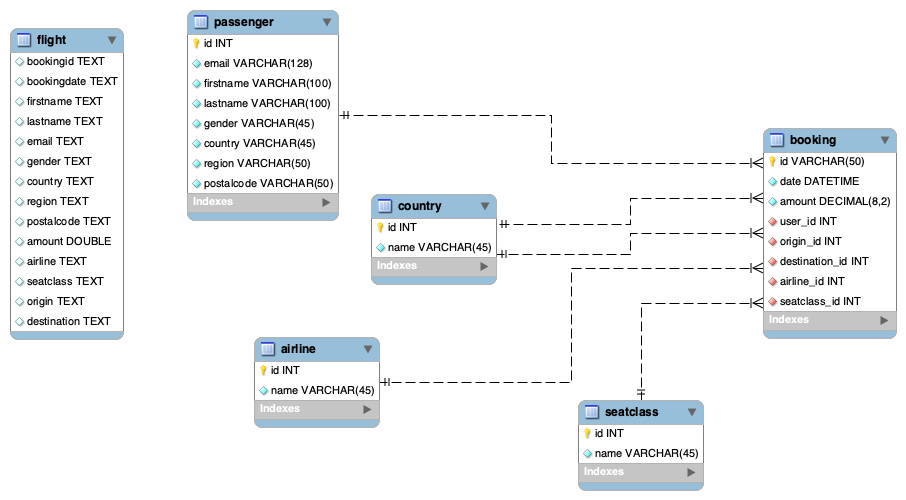

# Flight dataset Normalization 



The first step I took for this project is to normalized this database. Normalization is useful for the database as it:

1. Ensure data integrity
2. Minimize redundancy
3. Avoid anomalies

To do so, I created 5 different tables by inserting information from the original flight table  

### Passenger table 

```sql
INSERT INTO project1.passenger (`email`, `firstname`, `lastname`, `gender`, `country`, `region`, `postalcode`)
SELECT `email`, `firstname`, `lastname`, `gender`, `country`, `region`, `postalcode`
FROM project1.flight;
```
### Airline table 

 ```sql
INSERT INTO project1.airline (`name`)
SELECT DISTINCT  `airline`
FROM project1.flight;
```

### Country table 

```sql
INSERT INTO project1.country (`name`)
SELECT DISTINCT `origin`
FROM project1.flight; 
```
we have the same destination and origin 

### seatclass table 

```sql
INSERT INTO project1.seatclass (`name`, `airline_id`)
SELECT DISTINCT f.seatclass, a.id
FROM project1.flight f, project1.airline a;
```

### Booking table 

```sql
INSERT INTO project1.booking (`id`, `date`, `amount`, `user_id`, `origin_id`, `destination_id`, `airline_id`, `seatclass_id` )
SELECT f.bookingid, 
			f.bookingdate, 
			f.amount,
			p.id,
      o.id AS origin_id,
      d.id AS destination_id,
      a.id AS airline_id,
			s.id AS seatclass_id

FROM project1.flight f
JOIN project1.passenger p ON  f.email = p.email
JOIN project1.airline a ON f.airline = a.name
JOIN project1.seatclass s ON f.seatclass = s.name
JOIN project1.country o ON f.origin = o.name
JOIN project1.country d ON f.destination = d.name;
```

